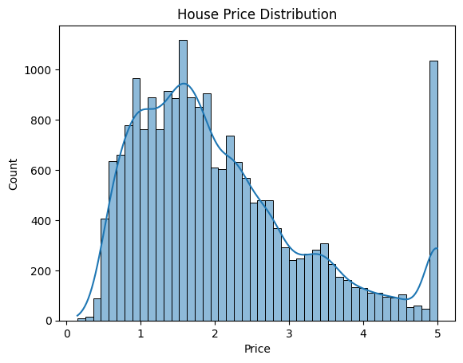

# House Price Prediction using Machine Learning

## 📌 Project Overview
This project predicts house prices using machine learning regression techniques. The objective is to understand the complete regression workflow including data preprocessing, model training, evaluation, and result interpretation.

---

## 📊 Dataset
- **Dataset Name:** California Housing Dataset
- **Source:** scikit-learn
- **Type:** Regression
- **Target Variable:** Median house price

---

## ⚙️ Model Used
- Linear Regression

---

## 🔍 Methodology
1. Load and explore the dataset
2. Check for missing values
3. Perform feature scaling
4. Split data into training and testing sets
5. Train a Linear Regression model
6. Evaluate using MSE and R² score
7. Analyze feature coefficients
8. Visualize residual errors

---

## 📈 Evaluation Metrics
- Mean Squared Error (MSE)
- R² Score

---

## 📸 Output Visualizations

### House Price Distribution


### Residual Plot


---

## 🧠 Conclusion
The Linear Regression model was able to capture the relationship between housing features and prices. Feature scaling and residual analysis helped improve model interpretation.

---

## 🛠️ Tools & Technologies
Python, NumPy, Pandas, Matplotlib, Seaborn, scikit-learn

---

## ▶️ How to Run
```bash
python house_price_prediction.py
